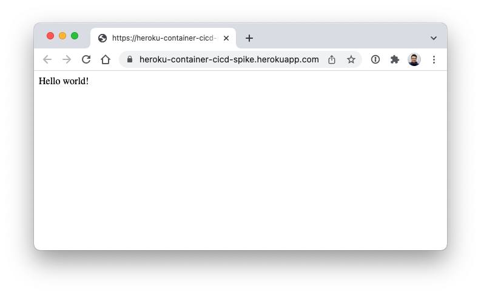

# Heroku container CI/CD process spike

## Usage

1. Create Heroku App
```shell
$ heroku apps:create heroku-container-cicd-spike
```

2. Generate long term token
```shell
$ heroku authorizations:create 
```

3. Refer to ./settings/secrets/actions (https://github.com/gitaction/heroku-container-cicd-spike/settings/secrets/actions), fill token with name: "HEROKU_TOKEN"

...
Deployment  will take care by GitHub Action.
...

Check:
```shell
$ heroku open -a heroku-container-cicd-spike
```


